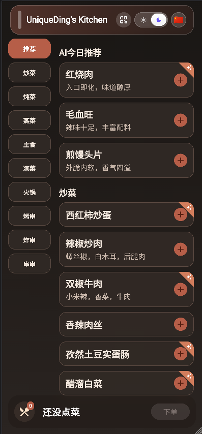
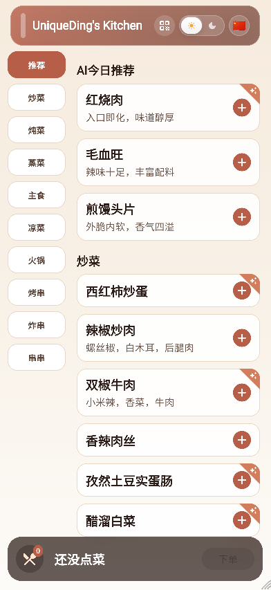

# UniqueDing Kitchen

一个基于 Flutter Web 的点餐应用，菜单和推荐内容由 Markdown 数据驱动。

- English version: [README.en.md](./README.en.md)

## 截图

### 白天主题

展示白天主题下的点餐首页，包括 AI 今日推荐、分类导航以及底部下单栏。

### 黑暗主题

展示黑暗主题下的菜单页面，包括分类菜品列表以及加单操作。

## 主要目录

- `lib/`：应用 UI 与运行时配置加载逻辑
- `web/public/`：可编辑的 Markdown 数据源（`menu.md`、`recommend.md`）
- `scripts/`：应用生命周期使用的运行/运维脚本
- `tools/branding/`：一次性的品牌/logo 生成辅助工具
- `docker/`：容器入口脚本
- `deploy/`：部署示例（`docker-compose.example.yaml`）
- `.github/workflows/`：Docker 发布相关 CI 工作流

## 常用命令

- 本地校验：`flutter analyze && flutter test`
- 本地 Chrome 运行：`flutter run -d chrome`
- Web 构建：`flutter build web --wasm --no-source-maps --no-web-resources-cdn --no-wasm-dry-run`
- 生成推荐 Markdown：`python3 scripts/generate_recommendation.py`

## 脚本与工具说明

- `scripts/generate_recommendation.py`：面向生产的辅助脚本，供 Docker 启动/cron 刷新 `recommend.md`
- `tools/branding/generate_logo_candidates_v4.py`：一次性 logo 候选生成工具，不参与运行时或部署流程

`generate_recommendation.py` 的路径行为：

- `PUBLIC_DIR` 控制基础目录（支持相对路径；默认优先 `public`，其次 `web/public`）
- 输出默认是 `${PUBLIC_DIR}/recommend.md`
- 可以通过 `RECOMMEND_FILE` 覆盖输出路径
- 脚本会先写入临时文件，再原子替换目标文件

`generate_recommendation.py` 的菜单来源行为：

- `MENU_SOURCE=local` 读取 `${PUBLIC_DIR}/menu.md`
- `MENU_SOURCE=trillium` 拉取并解析 `TRILLIUM_URL`（使用 `TRILLIUM_TITLE`）
- 生成的推荐格式为 Markdown 表格（`| 名称 | 描述 | 口味 | 小料 |`）

`generate_recommendation.py` 的 OpenAI 环境变量行为：

- URL 支持 `OPENAI_BASE_URL` / `OPENAI_URL` / `API_URL` / `BASE_URL`
- API Key 支持 `OPENAI_API_KEY` / `API_KEY`
- 模型支持 `OPENAI_MODEL` / `MODEL`
- URL 可以是基础地址（例如 `https://api.openai.com/v1`），也可以是完整接口地址（例如 `https://api.openai.com/v1/chat/completions`）

## Docker Compose 示例

可以把 `deploy/docker-compose.example.yaml` 作为模板：

`docker compose -f deploy/docker-compose.example.yaml up -d`

如果你是部署在反向代理的子路径下（例如 `/cook/`），需要设置：

- `WEB_BASE_HREF=/cook/`

该值必须以 `/` 开头并以 `/` 结尾。

## Trillium 菜单来源

运行时支持通过环境变量切换菜单来源：

- `MENU_SOURCE`：`local`（默认）或 `trillium`
- `TRILLIUM_URL`：HTML 文章地址，例如 `https://note.uniqueding.xyz/share/cooklist`
- `TRILLIUM_TITLE`：用于定位内容区块的文章标题标记，例如 `cooklist`

## 推荐定时任务

- `RECOMMEND_CRON_SCHEDULE`：每日生成推荐内容的 cron 表达式，默认 `0 0 * * *`
